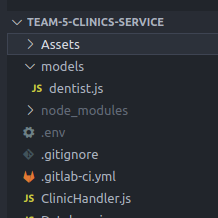

# Clinic Handler

## Description

This component is part of the the distributed system DENTISTIMO, a web application that offers a geolocalisation based dental care booking system.
The clinic handler provides other components with dentistry data and updates the database. More details can be found in the component diagram in the [documentation repository](https://git.chalmers.se/courses/dit355/test-teams-formation/team-5/team-4-project). 

## Component Responsibilities

- Read dentist data from URL
- Save dentist data to database
- Listen to MQTT broker for dentist data requests from frontend
- Publish dentistry data via MQTT

## Data input and output
### Data input

The component gets the dentist data from a JSON file.

The JSON objects should have at least these information for the following tasks:
- Store clinics: a JSON object following the clinic schema: 

<b>Example</b>

```
{
  "dentists": [
    {
      "id": 1,
      "name": "Your Dentist",
      "owner": "Dan Tist",
      "dentists": 3,
      "address": "Spannmålsgatan 20",
      "city": "Gothenburg",
      "coordinate": {
        "longitude": 11.969388,
        "latitude": 57.707619
      },
      "openinghours": {
        "monday": "9:00-17:00",
        "tuesday": "8:00-17:00",
        "wednesday": "7:00-16:00",
        "thursday": "9:00-17:00",
        "friday": "9:00-15:00"
      }
   },
```

### Data output

The component sends stringified JSON objects.


## Installing and running

### Prerequisits:
#### MQTT
You need to have a running version of <b>MQTT</b> on your machine. Please refer to this [link](https://www.google.com/url?sa=t&rct=j&q=&esrc=s&source=web&cd=&ved=2ahUKEwjG3fWb6NH0AhXpQvEDHSGLC2MQFnoECAMQAQ&url=https%3A%2F%2Fmosquitto.org%2Fdownload%2F&usg=AOvVaw2rLN-Os_zfUrtqeV1Lrunf) to download the mosquitto broker if you do not have any. 
#### Node.js
To download the latest version of node.js, please follow this [link](https://nodejs.org/en/download/)

### Instructions

| Step | Command |
| ------ | ------ |
| Start your MQTT broker on port 1883| This differs based on which broker, as well as your settings. Make sure the broker listens to port 1883. (Default port with mosquitto) |
| Clone this project on your machine | `git clone < SSH address or HTTPS address >` |
| Go to the repo and add .env file | Please contact one of the developers of this project to recieve the contents of the file. It should be placed directly in the repo. 
| Start the system from the repo by running the following  | `npm start` |

In the window of your broker, you should see a message similar to this:

`1638885841: New client connected from 127.0.0.1:49531 as Dentistimo Team5 - Clinic Handler n°3c1ff99e (p2, c1, k60).`

The Clinic Handler is now ready to proceed your requests. 
